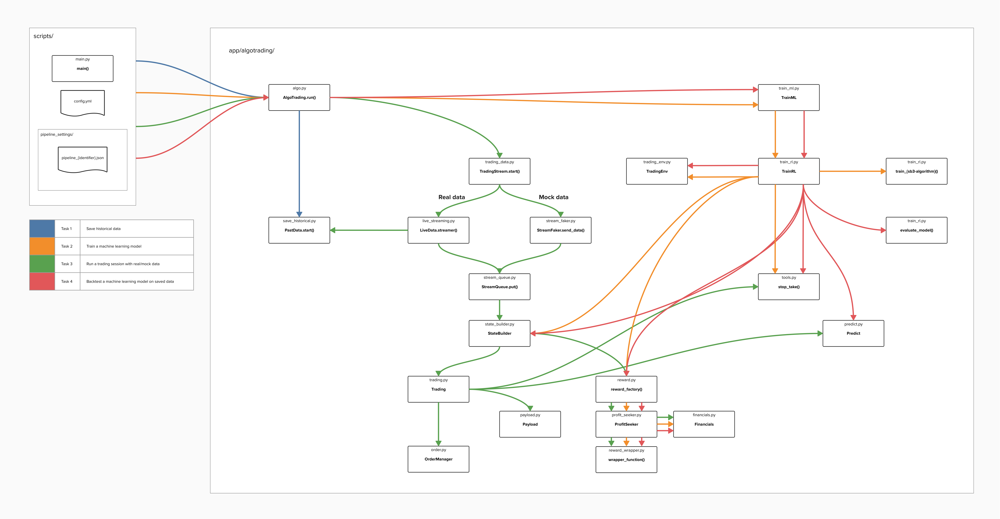
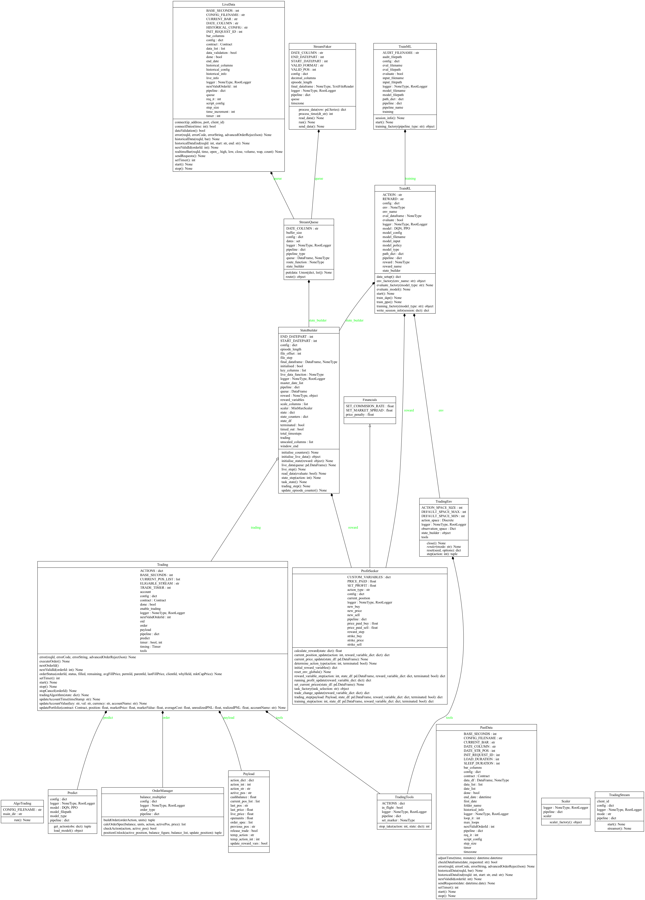
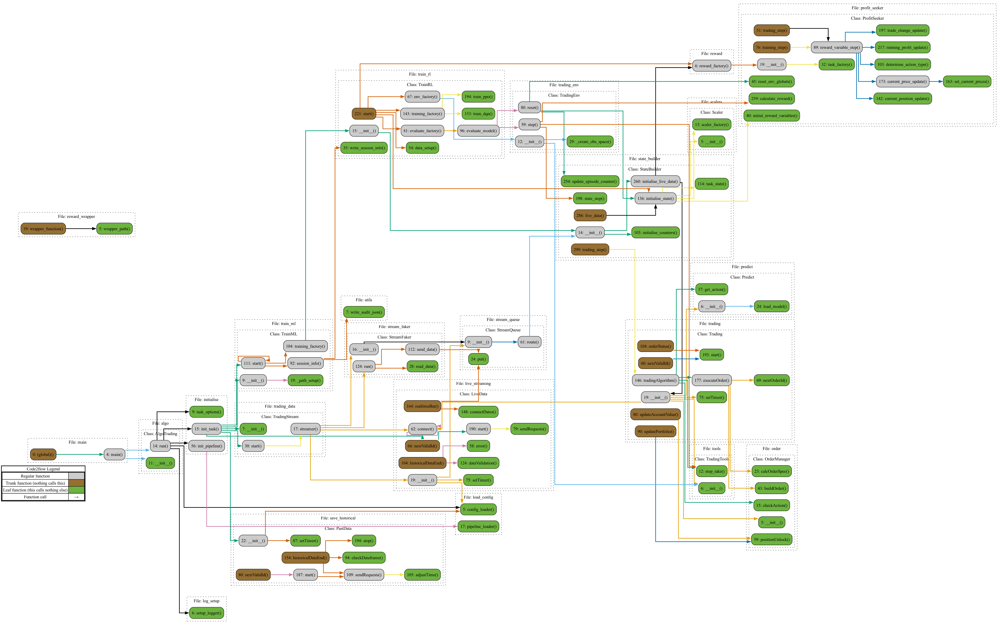

# algo-trading

Save historical stock market data, train reinforcement learning models on 
the same data in a realistic trading environment, backtest the model's 
performance and execute paper or live account trades using a trained 
model. This application leverages the Interactive Brokers TWS API to 
provide a set of straightforward and integrated tools, designed to train 
and deploy reinforcement learning models in the most realistic 
conditions, emulating the costs and constraints of live trading in the TWS 
platform.

### Purpose
Inspired by the many clickbait tutorials available that demo algorithmic 
trading projects, running and making *profits* in highly unrealistic 
environments. algo-trading is aligned to people who have dipped their 
toe into the world of using AI/ML agents for automated stock trading, and 
are ready to progress to trialling the feasibility of algorithmic trading 
strategies using their Interactive Brokers paper and eventually cash 
account.

### What problems does algo-trading address

- The cumbersome setup, validation and organisation of reliable and complete stock market data
- Using the centrally located data and easily configurable data pipeline to train a reinforcement learning model using Stable Baselines 3 algorithms
- Enables simple extension of the code to integrate additional algorithms
- Training a reinforcement learning model using a realistic environment that takes into account prices you would likely receive, including transaction costs and market buy/sell spreads
- Backtesting using the same environment and data structures as training
- Easy usage of a trained model in simulated trading sessions with an Interactive Brokers paper trading account
- Everything pre-configured to start trading with real money including strong order management guardrails such as stop loss/take profit limits, which are included in the model's training environment
- Logical places to extend the code for additional financial products (eg. Options), machine learning packages and reward functions

## Prerequisites

As mentioned previously, algo-trading provides functionality to build trading strategies using reinforcement learning, to be deployed using an Interactive Brokers paper or cash account. Therefore an Interactive Brokers account and market data subscriptions are required to use this package. The market data subscriptions recommended for US stock market data are below, which are a monthly expense that also requires a capital minimum of around $700 AUD in your account to subscribe. Once set up you can request the paper account at no additional cost.

Ensure you download and install the [TWS Desktop](https://www.interactivebrokers.com.au/en/trading/tws.php#tws-software) application to your machine, and [TWS API](https://interactivebrokers.github.io/#) to your virtual environment

#### Recommended market data subscriptions

- US Securities Snapshot and Futures Value Bundle (NP,L1)
- US Equity and Options Add-On Streaming Bundle (NP)

## Task overview

algo-trading provides four run options called tasks. Each time main.py is run, you execute an instance of a task. The task selection is made in `config.yml`.
Each task will have the following effect: 

**Task 1** - Request and save historical stock market data by listing the dates

**Task 2** - Train a machine learning model using the saved data

**Task 3** - Run a trading session using mock data locally or real data using 
your paper or cash account

**Task 4** - Backtest a trained model using the saved data

## Installation

1. Clone the repository
1. Navigate to the algo-trading directory `cd algo-trading`
1. Install the package `pip install .`
1. Run the main script `python scripts/main.py`

## Usage

Provided in the `scripts/` sample folder are the two types of configuration files needed to run an algo-trading task. `config.yml` contains settings such as task_selection, that could be modified each time a new task instance is run. The `pipeline_settings/` pipeline json files are allocated by `config.yml`, and act as project settings that are more enduring to the strategies you are testing for a particular stock.

Adjust the `config.yml` and pipeline json file settings, make the task selection and run main.py

- Ensure the TWS application is running on your local machine when running tasks 1 and 3
- By default, live_streaming.py and trading.py are set to run for 10 minutes, adjust the BASE_SECONDS variable and reinstall to change

Contact me if you would like an explanation of the project, and help to scale any of the functionality.

### Project Overview

## Appendix

#### Classes

#### Call Graph
